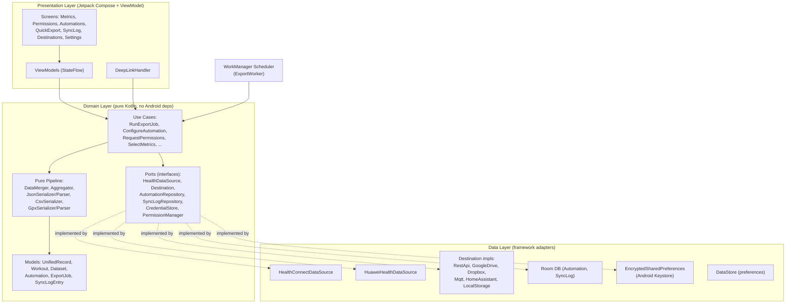
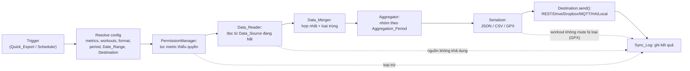
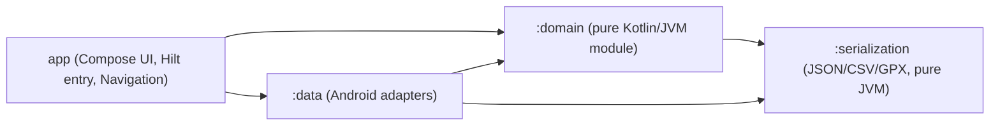
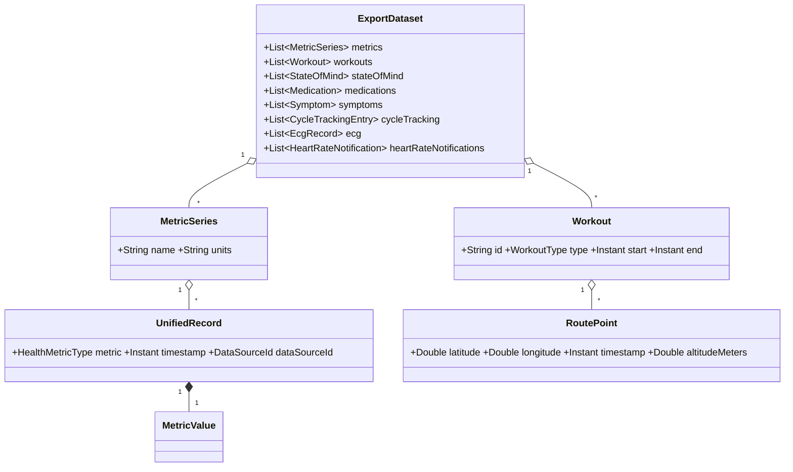

# Design Document

## Overview

Tài liệu này mô tả thiết kế kỹ thuật cho **Health Auto Export cho Android** (App) — một ứng dụng Android gốc (native), viết bằng **Kotlin**, tái hiện bộ tính năng của ứng dụng iOS "Health Auto Export". App đọc dữ liệu sức khỏe và thể chất từ hai Data_Source trên thiết bị (**Google Health Connect** và **Huawei Health Service Kit / HMS Health Kit**), hợp nhất và loại trùng dữ liệu chồng lấn, tổng hợp theo Aggregation_Period, rồi tuần tự hóa thành JSON / CSV / GPX và gửi tới một trong sáu loại Destination (REST API, Google Drive, Dropbox, MQTT, Home Assistant, Local Storage). Toàn bộ xử lý diễn ra trên thiết bị nhằm bảo đảm quyền riêng tư.

Thiết kế bám sát các nguyên tắc sau, ánh xạ trực tiếp tới các nhóm yêu cầu trong `requirements.md`:

- **Trừu tượng hóa Data_Source** (Requirements 1, 2, 3, 4, 5, 6): một interface `HealthDataSource` chung che giấu sự khác biệt giữa Health_Connect và Huawei_Health_Kit; mỗi nguồn tự lo phần quyền/ủy quyền và ánh xạ sang mô hình hợp nhất.
- **Mô hình dữ liệu hợp nhất chuẩn hóa** (Requirement 4, 7): `UnifiedRecord` và `Workout` mang giá trị đã chuyển về **đơn vị canonical**, kèm định danh Data_Source gốc, là đầu vào duy nhất cho merge/aggregate/serialize.
- **Pipeline xuất thuần (pure) tách khỏi I/O** (Requirements 7, 8, 9, 10, 11, 12): các bước Merge → Aggregate → Serialize là hàm thuần trên cấu trúc dữ liệu, cho phép kiểm thử dựa-trên-thuộc-tính (property-based testing) các thuộc tính khứ hồi (round-trip), tính bất biến (invariant) và tính idempotence.
- **Trừu tượng hóa Destination** (Requirements 16–21): một interface `Destination` chung cho sáu loại đích, mỗi loại đóng gói chính sách retry và quy tắc đặt tên/ghi đè riêng.
- **Thực thi nền tin cậy** (Requirement 15): `WorkManager` điều phối Scheduler với exponential backoff, dedupe lần chạy, và xử lý hạn chế thực thi nền.
- **Quyền riêng tư mặc định** (Requirement 22): không tài khoản, không telemetry, credential được bảo vệ bằng Android Keystore, không phát sinh kết nối mạng đi nếu chưa cấu hình Destination.

### Tech Stack

| Hạng mục | Lựa chọn | Lý do |
| --- | --- | --- |
| Ngôn ngữ | Kotlin (coroutines + Flow) | Chuẩn hiện đại cho Android, hỗ trợ bất đồng bộ có cấu trúc. |
| minSdk / targetSdk | minSdk 26 (Android 8.0), targetSdk 35 (Android 15) | Health_Connect client SDK yêu cầu API 26+; targetSdk gần nhất để tuân thủ chính sách Play và mô hình quyền nền mới. |
| Kiến trúc | MVVM + Clean Architecture (presentation / domain / data) | Tách bạch UI, business logic và truy cập dữ liệu; thuận lợi cho kiểm thử. |
| UI | Jetpack Compose + Navigation Compose | UI khai báo, dễ kiểm thử trạng thái. |
| DI | Hilt | Tiêm phụ thuộc chuẩn cho Android, hỗ trợ WorkManager. |
| Nguồn Google | `androidx.health.connect:connect-client` | SDK chính thức cho Health_Connect. |
| Nguồn Huawei | HMS Health Kit SDK (`com.huawei.hms:health`) | SDK chính thức cho Huawei_Health_Kit. |
| Nền/lịch | `androidx.work:work-runtime-ktx` (WorkManager) | Thực thi nền có ràng buộc, backoff, retry. |
| Lưu trữ cấu trúc | Room | Lưu Automation và Sync_Log. |
| Lưu trữ tùy chọn | Jetpack DataStore (Preferences) | Lưu lựa chọn Data_Source, ưu tiên nguồn, cấu hình chung. |
| Credential | Jetpack Security `EncryptedSharedPreferences` (Android Keystore) | Lưu thông tin xác thực Destination được mã hóa (Requirement 22.9). |
| JSON | kotlinx.serialization + bộ ghi số thập phân tùy chỉnh (`BigDecimal`) | Kiểm soát chính xác định dạng số `qty` (Requirement 10.5). |
| HTTP | OkHttp + Retrofit | REST API và Home Assistant. |
| MQTT | HiveMQ MQTT Client (hoặc Eclipse Paho) | Hỗ trợ QoS 0/1/2 và TLS. |
| Drive/Dropbox | Google Drive REST API client + Dropbox Android SDK | Tải tệp lên đích đám mây. |
| Kiểm thử property | **Kotest Property** (`kotest-property`) | Thư viện PBT trưởng thành cho Kotlin; dùng cho round-trip, invariant, idempotence. |
| Kiểm thử unit | JUnit5 + MockK + Turbine | Unit test, mock, kiểm thử Flow. |

### Nguồn tham chiếu định dạng

Định dạng JSON đầu ra bám theo tài liệu chính thức của Health Auto Export: đối tượng cấp cao nhất `data` luôn chứa tám mảng `metrics`, `workouts`, `stateOfMind`, `medications`, `symptoms`, `cycleTracking`, `ecg`, `heartRateNotifications`; mỗi metric tiêu chuẩn có `name` (snake_case), `units`, `data[]` với `qty` và `date` định dạng `yyyy-MM-dd HH:mm:ss Z`; một số metric có lược đồ riêng (`blood_pressure`, `heart_rate`, `sleep_analysis`, `blood_glucose`, ...). Nội dung này được tham khảo và diễn giải lại từ [tài liệu JSON Export Format của HealthyApps](https://help.healthyapps.dev/en/health-auto-export/export-format) và [tài liệu Health Metrics](https://help.healthyapps.dev/en/health-auto-export/export-format/health-metrics). *Nội dung đã được diễn giải lại để tuân thủ ràng buộc bản quyền.*

## Architecture

### Phân lớp Clean Architecture

App được tổ chức thành ba lớp chính, phụ thuộc một chiều từ ngoài vào trong (presentation → domain ← data). Lớp `domain` không phụ thuộc framework Android, giúp business logic (đặc biệt là pipeline Merge/Aggregate/Serialize) trở thành các hàm thuần dễ kiểm thử.



### Pipeline Export_Job

Trung tâm của App là một pipeline xuất thuần, tách bạch phần I/O (đọc nguồn, gửi đích) với phần biến đổi dữ liệu (merge/aggregate/serialize). Việc tách này cho phép kiểm thử PBT phần lõi mà không cần thiết bị hay mạng.



Ranh giới **pure / impure**:

- **Impure (I/O)**: bước C (truy vấn quyền), D (đọc nguồn), H (gửi đích), I (ghi log). Các bước này nằm sau Ports và được mock trong test.
- **Pure (xác định, không side-effect)**: bước E (Merge), F (Aggregate), G (Serialize/Parse). Đây là nơi tập trung các Correctness Property.

### Concurrency & lifecycle

- Mỗi Export_Job chạy trong một coroutine scope riêng. `RunExportJobUseCase` phát ra `Flow<ExportProgress>` để UI hiển thị phần trăm (Requirement 13.2) và để hỗ trợ hủy hợp tác (cooperative cancellation) trong 5 giây (Requirement 13.6).
- Khi chạy nền, `ExportWorker` (CoroutineWorker của WorkManager) gọi cùng `RunExportJobUseCase`, đảm bảo logic xuất giống nhau giữa Quick_Export và xuất theo lịch.
- Một `ExportJobMutex` trong domain bảo đảm chỉ một Quick_Export chạy tại một thời điểm (Requirement 13.5) và chỉ một lần chạy của mỗi Automation (Requirements 15.1, 15.5) thông qua khóa theo `automationId` (dùng `WorkManager` unique work với `ExistingWorkPolicy.KEEP`).

### Module Gradle



`:domain` và `:serialization` là module Kotlin/JVM thuần (không phụ thuộc Android SDK), cho phép chạy PBT nhanh trên JVM mà không cần Robolectric/emulator.

## Components and Interfaces

Phần này mô tả các thành phần chính, ánh xạ với các định danh trong Bảng thuật ngữ và các yêu cầu liên quan. Chữ ký dùng Kotlin minh họa; chi tiết phụ trợ có thể được tinh chỉnh khi triển khai.

### Data_Source abstraction

Interface chung che giấu khác biệt giữa Health_Connect và Huawei_Health_Kit. Mỗi nguồn tự lo kiểm tra khả dụng, ánh xạ loại bản ghi sang `UnifiedRecord` (đã chuẩn hóa đơn vị) và gắn `dataSourceId`.

```kotlin
enum class DataSourceId { HEALTH_CONNECT, HUAWEI_HEALTH_KIT } // định danh ổn định, dùng để sắp xếp bảng chữ cái

interface HealthDataSource {
    val id: DataSourceId

    /** Requirement 1.1 / 2.1: kiểm tra khả dụng (SDK cài đặt, dịch vụ sẵn sàng). */
    suspend fun availability(): SourceAvailability

    /** Requirement 4.6: các Health_Metric mà nguồn có thể cung cấp trên thiết bị hiện tại. */
    suspend fun supportedMetrics(): Set<HealthMetricType>

    /** Requirements 1.5/3.x/5.x/6.x: đọc bản ghi đã chuẩn hóa trong Date_Range. */
    suspend fun readRecords(
        metrics: Set<HealthMetricType>,
        workouts: Set<WorkoutType>,
        range: DateRange,
    ): SourceReadResult
}

sealed interface SourceAvailability {
    data object Available : SourceAvailability
    data class Unavailable(val reason: String, val installLink: String? = null) : SourceAvailability
}

/** Bản ghi đọc được + danh sách cảnh báo (bản ghi bỏ qua, trường thiếu...) để ghi Sync_Log. */
data class SourceReadResult(
    val records: List<UnifiedRecord>,
    val workouts: List<Workout>,
    val warnings: List<ReadWarning>,
)
```

- `HealthConnectDataSource` (Requirement 1): dùng `HealthConnectClient`, `PermissionController`, `TimeRangeFilter`. Quyền nền dùng `PERMISSION_READ_HEALTH_DATA_IN_BACKGROUND` (Requirements 1.5, 1.10). Khi không khả dụng, trả về `Unavailable` kèm liên kết Play Store cài/cập nhật Health_Connect (Requirements 1.1, 1.8).
- `HuaweiHealthDataSource` (Requirement 2): dùng HMS Health Kit `HealthKitAuthClient` / `DataController`. Khi HMS Core không khả dụng, đánh dấu nguồn `Unavailable` và App tiếp tục với Health_Connect (Requirement 2.1). Timeout ủy quyền 60 giây (Requirement 2.8).

### Permission_Manager

```kotlin
interface PermissionManager {
    /** Requirements 1.2/2.2: yêu cầu quyền chỉ cho metric/workout đã chọn. */
    suspend fun requestReadPermissions(source: DataSourceId, selection: MetricSelection): PermissionRequestResult

    /** Requirements 1.5/1.10: quyền đọc nền cho xuất theo lịch. */
    suspend fun requestBackgroundReadPermission(source: DataSourceId): PermissionRequestResult

    /** Requirements 1.7/2.7: trạng thái hiển thị cho từng metric. */
    suspend fun grantedStatus(source: DataSourceId, selection: MetricSelection): Map<HealthMetricType, PermissionState>

    /** Requirements 1.6/2.6: phát hiện thu hồi / xóa scope đã lưu. */
    suspend fun refreshGrants(source: DataSourceId): Set<HealthPermission>
}

enum class PermissionState { GRANTED, NOT_GRANTED }
```

Tập quyền đã cấp được lưu qua `DataStore` (Requirements 1.3, 2.3). Khi yêu cầu lỗi/timeout, giữ nguyên tập quyền cũ và ghi Sync_Log (Requirements 1.9, 2.8). `RunExportJobUseCase` luôn gọi `refreshGrants` đầu mỗi job để phát hiện quyền bị thu hồi và loại metric bị ảnh hưởng (Requirements 1.6, 2.6).

### Data_Reader & Data_Source selection

`DataReader` điều phối nhiều `HealthDataSource` theo lựa chọn bật/tắt (Requirement 3):

```kotlin
class DataReader(
    private val sources: Map<DataSourceId, HealthDataSource>,
    private val sourceToggles: SourceToggleStore,      // Requirements 3.1, 3.2 (lưu qua DataStore)
    private val clock: Clock,
) {
    /** Requirements 3.3–3.7, 4.x, 5.x, 6.x. Áp dụng timeout 30s/nguồn; lỗi nguồn -> tiếp tục nguồn còn lại. */
    suspend fun read(selection: MetricSelection, range: DateRange): ReadOutcome
}

sealed interface ReadOutcome {
    data class Success(val perSource: List<SourceReadResult>) : ReadOutcome
    data class NoEnabledSource(val reason: String) : ReadOutcome        // Requirement 3.7
    data class AllSourcesUnavailable(val reason: String) : ReadOutcome  // Requirement 3.6
}
```

- Timeout 30 giây/nguồn dùng `withTimeoutOrNull`; nguồn quá hạn bị coi là không khả dụng, job tiếp tục với nguồn còn lại và ghi Sync_Log (Requirement 3.5).
- Ánh xạ và chuẩn hóa đơn vị (Requirement 4.2) qua `MetricMapper` của từng nguồn; bản ghi không ánh xạ được bị bỏ qua kèm cảnh báo (Requirement 4.7).

### Data_Merger

```kotlin
class DataMerger(
    private val tolerances: DuplicateToleranceTable, // Requirement 7.2: theo từng HealthMetricType
    private val priority: SourcePriority,            // Requirements 7.4, 7.8 (cấu hình bởi người dùng)
) {
    /** Requirements 7.1, 7.3–7.7: hợp nhất + loại trùng + sắp xếp xác định. */
    fun merge(perSource: List<SourceReadResult>): MergedDataset
}
```

Thuật toán (xác định, thuần) cho mỗi `HealthMetricType`:
1. Gộp toàn bộ bản ghi từ mọi nguồn thành một danh sách.
2. Sắp xếp theo khóa tổng `(timestamp, dataSourceId, value)` tăng dần (Requirement 7.6).
3. Duyệt tuyến tính; hai bản ghi là trùng nếu `|Δtimestamp| ≤ tolTime(metric)` **và** `|Δvalue| ≤ tolValue(metric)` (Requirement 7.3). Khi trùng, giữ bản theo ưu tiên nguồn cao nhất; nếu ưu tiên bằng nhau, giữ `dataSourceId` đứng trước theo bảng chữ cái (Requirements 7.4, 7.5).
4. Nếu chênh thời gian ≤ tolerance nhưng chênh giá trị > tolValue, giữ cả hai và gắn nhãn nguồn (Requirement 7.7).
5. Kết quả được sắp xếp lại theo (Requirement 7.6). Vì đầu ra đã ở dạng chuẩn tắc (canonical) và đã loại trùng, chạy `merge` lần nữa trên kết quả cho ra kết quả y hệt — **idempotence** (Requirement 7.9).

### Aggregator

```kotlin
class Aggregator(private val zoneProvider: ZoneIdProvider) {
    /** Requirements 8.1–8.8. */
    fun aggregate(dataset: MergedDataset, period: AggregationPeriod): AggregatedDataset
}

enum class AggregationPeriod { SECOND, MINUTE, HOUR, DAY, WEEK, MONTH, YEAR }
enum class MetricKind { CUMULATIVE, INSTANTANEOUS } // gắn cho mỗi HealthMetricType
```

- `SECOND` ⇒ trả về bản ghi thô không tổng hợp (Requirement 8.7).
- Khung là khoảng nửa mở `[start, end)` căn theo ranh giới lịch theo múi giờ thiết bị tại thời điểm job (Requirement 8.3): phút @ :00, giờ @ phút 00, ngày @ 00:00:00, tuần @ Thứ Hai 00:00:00, tháng @ ngày 1, năm @ 1/1. Dùng `java.time` (`ZonedDateTime`, `TemporalAdjusters`).
- Metric `CUMULATIVE` ⇒ tổng (sum) cho khung (Requirement 8.4). Metric `INSTANTANEOUS` ⇒ `{min, avg, max, count}` (Requirement 8.5).
- Khung rỗng bị bỏ qua, không phát ra khung trống hay giá trị 0 (Requirement 8.6).
- Giấc ngủ tổng hợp theo ngày: tổng thời lượng + thời lượng từng giai đoạn, khung ngày căn @ 00:00:00 (Requirement 8.8).

### Serializers / Parsers

Tất cả nằm trong module `:serialization`, thuần JVM. Định dạng dấu thời gian dùng chung `yyyy-MM-dd HH:mm:ss Z` (Requirements 10.7, 11.4); GPX dùng ISO 8601 UTC giây (Requirement 12.4).

```kotlin
interface JsonSerializer { fun serialize(dataset: ExportDataset): String }   // Requirement 10
interface JsonParser     { fun parse(text: String): Result<ExportDataset> }   // Requirements 10.8, 10.9

interface CsvSerializer  { fun serialize(dataset: ExportDataset): CsvArchive } // Requirement 11

interface GpxSerializer  { fun serialize(workouts: List<Workout>): String }    // Requirement 12
interface GpxParser      { fun parse(xml: String): Result<List<WorkoutRoute>> }// Requirements 12.6, 12.7
```

- **JSON_Serializer** (Requirement 10): đóng gói trong `data` với đủ 8 mảng, mảng rỗng `[]` thay vì null/bỏ khóa (Requirements 10.1, 10.3); UTF-8 không BOM (Requirement 10.2); `qty` ghi bằng `BigDecimal.toPlainString()` (ký pháp thập phân, giữ dấu, ≥ 6 chữ số thập phân, không làm tròn mất dữ liệu — Requirement 10.5); metric có lược đồ riêng phát theo schema đã tài liệu hóa (Requirement 10.6).
- **JSON_Parser** (Requirements 10.8, 10.9): khôi phục `ExportDataset` bằng (round-trip); đầu vào không hợp lệ trả về lỗi mô tả phần tử vi phạm, không tạo dataset một phần.
- **CSV_Serializer** (Requirement 11): một tài liệu CSV mỗi metric, thứ tự cột cố định, header + 1 dòng/bản ghi (Requirements 11.1, 11.2); escape RFC-4180 cho dấu phẩy/nháy/xuống dòng (Requirement 11.3); trường rỗng để trống (Requirement 11.5); UTF-8 không BOM (Requirement 11.6); kết thúc dòng CRLF (Requirement 11.7); đóng gói nhiều CSV vào một archive ZIP, đặt tên theo định danh metric (Requirement 11.8).
- **GPX_Serializer/Parser** (Requirement 12): GPX 1.1; mỗi Workout một `<trk>`, mỗi route một `<trkseg>`, mỗi điểm một `<trkpt>` với `lat`/`lon` là thuộc tính, `<ele>`/`<time>` là phần tử con (Requirements 12.1–12.3, 12.5); nhiều workout ⇒ một tài liệu nhiều track theo thứ tự cung cấp (Requirement 12.5).

### Destination abstraction

```kotlin
interface Destination {
    val type: DestinationType
    /** Gửi payload đã tuần tự hóa. Trả về kết quả để ghi Sync_Log. */
    suspend fun send(payload: ExportPayload, config: DestinationConfig): DestinationResult
}

enum class DestinationType { REST_API, GOOGLE_DRIVE, DROPBOX, MQTT, HOME_ASSISTANT, LOCAL_STORAGE }

data class ExportPayload(
    val bytes: ByteArray,        // nội dung đã tuần tự hóa (UTF-8 hoặc ZIP)
    val contentType: String,     // Requirement 16.3
    val jobStartUtc: Instant,    // Requirement 21.3: đặt tên tệp theo thời điểm bắt đầu
    val format: ExportFormat,
)

sealed interface DestinationResult {
    data class Success(val detail: String) : DestinationResult            // ví dụ tên tệp đã lưu
    data class Failure(val reason: String, val retryEligible: Boolean) : DestinationResult
}
```

Các hiện thực và đặc thù:

| Destination | Hiện thực | Đặc thù chính |
| --- | --- | --- |
| REST API (Req 16) | OkHttp/Retrofit | URL ≤ 2048 ký tự HTTP/HTTPS, ≤ 50 header tùy chỉnh, Content-Type theo format, timeout 30s, 2xx = thành công, cảnh báo non-HTTPS, chặn payload > 100MB. |
| Google Drive (Req 17) | Drive REST v3 (file-creation scope) | Upload vào thư mục cấu hình; trùng tên ⇒ thêm hậu tố số (không ghi đè); retry tối đa 3 lần ≥ 30s; timeout 120s/50MB. |
| Dropbox (Req 18) | Dropbox Android SDK (app-folder scope) | Khởi tạo ủy quyền ≤ 2s; trùng tên ⇒ hậu tố phân biệt; retry tối đa 3 lần ≥ 5s. |
| MQTT (Req 19) | HiveMQ MQTT Client | host/port (1–65535)/topic; QoS 0/1/2; TLS tùy chọn; QoS0 fire-and-forget; QoS1/2 chờ ack ≤ 30s. |
| Home Assistant (Req 20) | OkHttp/Retrofit | base URL + long-lived token; cảnh báo non-HTTPS; timeout 30s; lỗi auth ⇒ nhắc cập nhật token; giữ dữ liệu để thử lại. |
| Local Storage (Req 21) | Storage Access Framework (`DocumentFile`) | Đặt tên `YYYYMMDD-HHMMSS` (UTC) + đuôi định dạng; trùng tên ⇒ hậu tố `-N` (1..1000); kiểm tra dung lượng trước khi ghi; không để tệp một phần. |

Chính sách retry chung cho job theo lịch (Requirement 15.7): exponential backoff bắt đầu 30s, trần 30 phút, tối đa 5 lần — được điều phối ở tầng Scheduler (WorkManager), trong khi retry nội bộ của Drive/Dropbox (3 lần) áp dụng cho cả Quick_Export.

### Scheduler

```kotlin
interface Scheduler {
    fun schedule(automation: Automation)   // Requirements 15.1–15.3
    fun cancel(automationId: String)        // Requirement 14.9
}
```

Hiện thực bằng `WorkManager` `PeriodicWorkRequest` (khoảng 15 phút–30 ngày, Requirement 15.3) với `setBackoffCriteria(EXPONENTIAL, 30s, ...)`, `ExistingPeriodicWorkPolicy.UPDATE`, unique name = `automationId`. Dedupe lần chạy chồng lấn dùng khóa theo `automationId` + ghi "bị bỏ qua do trùng lặp" (Requirement 15.5). Khi thiết bị hạn chế nền, hiển thị hướng dẫn xin miễn trừ (Requirement 15.10).

### DeepLinkHandler

Phân tích deep link cấu hình Automation (Requirements 14.6, 14.8): điền sẵn các trường, kiểm tra tham số (Export_Format, Aggregation_Period, Destination) thuộc tập hợp lệ; nếu thiếu/sai/ngoài tập giá trị ⇒ từ chối điền, không tạo Automation, hiển thị lỗi; nếu hợp lệ ⇒ trình bày để người dùng xác nhận trước khi lưu.

### Repositories & CredentialStore

- `AutomationRepository`, `SyncLogRepository`: Room DAO (Requirements 14.5, 23.x).
- `CredentialStore`: `EncryptedSharedPreferences` bảo vệ bởi Android Keystore (Requirement 22.9).
- `DataWipeUseCase`: xóa Automation + credential + Sync_Log trong 10s, xác nhận liệt kê loại dữ liệu đã xóa, giữ nguyên nếu lỗi (Requirements 22.6–22.8).

## Data Models

### Mô hình hợp nhất (canonical) — domain

Đây là mô hình trung tâm mà toàn bộ pipeline thao tác. Giá trị luôn ở **đơn vị canonical** của từng `HealthMetricType` (Requirement 4.2), và mỗi bản ghi mang định danh nguồn gốc (Requirements 4.5, 7.7).

```kotlin
/** Một điểm dữ liệu đã chuẩn hóa — Unified_Record. */
data class UnifiedRecord(
    val metric: HealthMetricType,
    val value: MetricValue,            // hỗ trợ giá trị đơn (qty) và giá trị có cấu trúc
    val unit: CanonicalUnit,           // đơn vị canonical của metric
    val timestamp: Instant,            // UTC (Requirement 9.4)
    val zoneOffset: ZoneOffset,        // để định dạng `... Z`
    val dataSourceId: DataSourceId,    // Requirements 4.5, 7.x
    val extras: Map<String, ExtraValue> = emptyMap(), // mealTime, reason, value(sleep state)...
)

/** qty giữ độ chính xác bằng BigDecimal để bảo toàn round-trip JSON (Requirement 10.5). */
sealed interface MetricValue {
    data class Scalar(val qty: BigDecimal) : MetricValue
    data class BloodPressure(val systolic: BigDecimal, val diastolic: BigDecimal) : MetricValue
    data class HeartRateStat(val min: BigDecimal, val avg: BigDecimal, val max: BigDecimal) : MetricValue
    data class SleepSegment(val state: SleepState, val durationSeconds: Long) : MetricValue // Requirement 6.1
    data class Ecg(                                                                          // Requirement 6.2
        val classification: String,
        val averageBpm: Int,            // 0..300
        val samplingHz: BigDecimal,     // > 0
        val voltages: List<BigDecimal>, // theo thứ tự ghi nhận
    ) : MetricValue
    // ... các biến thể có lược đồ riêng khác
}

enum class SleepState { AWAKE, REM, CORE, DEEP, ASLEEP, IN_BED, UNSPECIFIED }
```

### Workout & Route

```kotlin
data class Workout(
    val id: String,
    val type: WorkoutType,
    val start: Instant,
    val end: Instant,
    val durationSeconds: Long,
    val route: List<RoutePoint>? = null,           // Requirement 5.2 (sắp xếp tăng dần theo timestamp)
    val heartRateSeries: List<HeartRateSample>? = null, // Requirement 5.4
    val optionalFields: WorkoutMetrics = WorkoutMetrics(), // Requirement 5.5 (chỉ trường khả dụng)
    val dataSourceId: DataSourceId,
)

data class RoutePoint(
    val latitude: Double,
    val longitude: Double,
    val timestamp: Instant,
    val altitudeMeters: Double? = null, // Requirement 5.3: có thể vắng, giữ điểm
)

/** Chỉ chứa trường khả dụng; trường vắng = null và bị bỏ qua khi serialize (Requirement 5.5). */
data class WorkoutMetrics(
    val activeEnergyKcal: BigDecimal? = null,
    val totalEnergyKcal: BigDecimal? = null,
    val distanceMeters: BigDecimal? = null,
    val avgSpeedMps: BigDecimal? = null,
    val elevationGainMeters: BigDecimal? = null,
    val stepCount: Long? = null,
    val heartRateRecovery: List<HeartRateSample>? = null,
)
```

### Cấu trúc dataset cho serialize

```kotlin
/** Đầu vào duy nhất cho mọi Serializer; phản chiếu envelope 8 mảng (Requirement 10.1). */
data class ExportDataset(
    val metrics: List<MetricSeries>,            // metric tiêu chuẩn + lược đồ riêng
    val workouts: List<Workout>,
    val stateOfMind: List<StateOfMind>,
    val medications: List<Medication>,
    val symptoms: List<Symptom>,
    val cycleTracking: List<CycleTrackingEntry>,
    val ecg: List<EcgRecord>,
    val heartRateNotifications: List<HeartRateNotification>,
)

data class MetricSeries(
    val name: String,            // snake_case (vd "step_count")
    val units: String,           // chuỗi đơn vị canonical (vd "count", "bpm")
    val data: List<UnifiedRecord>,
)
```

`ExportDataset` luôn hiện diện đủ 8 danh mục (mảng rỗng nếu không có bản ghi) để bảo toàn round-trip JSON (Requirements 10.1, 10.3, 10.8).

### Sơ đồ quan hệ mô hình



### Mô hình lưu trữ — Room

```kotlin
@Entity(tableName = "automations", indices = [Index(value = ["nameLower"], unique = true)]) // Requirement 14.7
data class AutomationEntity(
    @PrimaryKey val id: String,
    val name: String,                 // 1..100 ký tự (Requirement 14.1)
    val nameLower: String,            // so trùng không phân biệt hoa/thường
    val selectedMetricsJson: String,
    val selectedWorkoutsJson: String,
    val exportFormat: ExportFormat,
    val aggregationPeriod: AggregationPeriod,
    val scheduleIntervalMinutes: Long, // 15..43200 (Requirement 15.3)
    val enabled: Boolean,
    val destinationType: DestinationType,
    val destinationConfigRef: String, // tham chiếu cấu hình; credential nằm ở CredentialStore
    val firstActivatedAtUtc: Long?,   // Requirement 9.9
    val lastSuccessfulEndUtc: Long?,  // Requirement 9.8
)

@Entity(tableName = "sync_log") // Requirement 23
data class SyncLogEntity(
    @PrimaryKey val id: String,
    val startUtc: Long,               // Requirement 23.1, 23.3 (tie-break)
    val completionUtc: Long?,         // Requirement 23.3 (sắp xếp giảm dần)
    val automationId: String?,
    val exportFormat: ExportFormat?,
    val destinationType: DestinationType?,
    val status: ExportStatus,         // SUCCESS, FAILURE, SKIPPED, EMPTY, CANCELLED
    val message: String?,             // mô tả người dùng đọc được, KHÔNG chứa dữ liệu thô (Req 23.4)
)
```

- Sync_Log hiển thị giảm dần theo `completionUtc`, tie-break giảm dần theo `startUtc` (Requirement 23.3).
- Khi vượt giới hạn (mặc định 500, cấu hình 50–5000), xóa mục cũ nhất theo `completionUtc` (tie-break `startUtc`) cho tới khi đạt giới hạn (Requirement 23.5).
- Credential **không** lưu trong Room; chỉ lưu ở `EncryptedSharedPreferences` (Requirement 22.9).

### Bảng dung sai trùng lặp & ưu tiên nguồn

```kotlin
/** Requirement 7.2: mỗi metric có dung sai thời gian (giây, ≥0) và dung sai giá trị (≥0). */
data class DuplicateTolerance(val timeSeconds: Long, val valueMagnitude: BigDecimal)
typealias DuplicateToleranceTable = Map<HealthMetricType, DuplicateTolerance>

/** Requirements 7.4, 7.8: thứ hạng ưu tiên do người dùng cấu hình cho mỗi DataSourceId. */
data class SourcePriority(val ranks: Map<DataSourceId, Int>)
```

### Date_Range

```kotlin
data class DateRange(val startUtc: Instant, val endUtc: Instant) {
    init { require(!endUtc.isBefore(startUtc)) } // Requirements 9.2, 9.3 (cho phép bằng nhau)
}
```

Diễn giải theo UTC (Requirement 9.4); so sánh bao gồm cả hai đầu mút (Requirement 9.5); mặc định Quick_Export = từ 00:00:00 UTC hôm nay tới hiện tại (Requirement 9.7); clamp endUtc về hiện tại nếu ở tương lai (Requirement 9.6); Automation dùng cửa sổ nối tiếp theo lần thành công gần nhất (Requirements 9.8, 9.9).

## Canonical Units và Metric Catalog Mapping

Phần này định nghĩa **đơn vị canonical** cho từng `HealthMetricType` và bảng ánh xạ từ loại bản ghi của mỗi Data_Source sang tên chỉ số chuẩn của App (Requirements 4.1, 4.2). Mỗi metric được phân loại `CUMULATIVE` (tích lũy) hoặc `INSTANTANEOUS` (tức thời) để Aggregator chọn đúng phép tóm tắt (Requirements 8.4, 8.5).

### Nguyên tắc chuẩn hóa

- Mỗi `HealthMetricType` có **đúng một** `CanonicalUnit`. Mọi bản ghi nguồn được chuyển về đơn vị này tại `DataReader` (Requirement 4.2). Bản ghi không chuyển đổi được bị bỏ qua kèm cảnh báo (Requirement 4.7).
- `name` trong JSON dùng **snake_case** ổn định (vd `step_count`, `heart_rate`), `units` là chuỗi đơn vị canonical (vd `count`, `bpm`, `kcal`).
- Phân loại `MetricKind`:
  - **CUMULATIVE**: đại lượng cộng dồn theo thời gian (bước, quãng đường, năng lượng, nước, dinh dưỡng). Tổng hợp = tổng (sum).
  - **INSTANTANEOUS**: phép đo tại một thời điểm (nhịp tim, SpO2, cân nặng, huyết áp). Tổng hợp = `{min, avg, max, count}`.
- Một metric mà **không** Data_Source nào đang bật cung cấp được đánh dấu "không hỗ trợ trên thiết bị" và bị loại khỏi danh sách chọn (Requirement 4.3, 4.6).

### Bảng danh mục (đại diện, có thể mở rộng)

Bảng dưới đây liệt kê các nhóm theo Requirement 4.1. Cột Health_Connect dùng tên record của `androidx.health.connect.client.records`; cột Huawei dùng hằng `DataType` của HMS Health Kit. `—` nghĩa là nền tảng không phơi bày loại đó → metric chỉ khả dụng khi nguồn còn lại cung cấp (Requirement 4.3).

| Nhóm | Canonical name | Đơn vị canonical | Kind | Health_Connect record | Huawei DataType |
| --- | --- | --- | --- | --- | --- |
| Activity | `step_count` | `count` | CUMULATIVE | `StepsRecord` | `DT_CONTINUOUS_STEPS_DELTA` |
| Activity | `distance` | `m` | CUMULATIVE | `DistanceRecord` | `DT_CONTINUOUS_DISTANCE_DELTA` |
| Activity | `active_energy` | `kcal` | CUMULATIVE | `ActiveCaloriesBurnedRecord` | `DT_CONTINUOUS_CALORIES_BURNT` |
| Activity | `basal_energy_burned` | `kcal` | CUMULATIVE | `TotalCaloriesBurnedRecord` | `DT_CONTINUOUS_CALORIES_BMR` |
| Activity | `flights_climbed` | `count` | CUMULATIVE | `FloorsClimbedRecord` | — |
| Activity | `step_cadence` | `count/min` | INSTANTANEOUS | `StepsCadenceRecord` | — |
| Activity | `walking_running_speed` | `m/s` | INSTANTANEOUS | `SpeedRecord` | `DT_INSTANTANEOUS_SPEED` |
| Activity | `wheelchair_pushes` | `count` | CUMULATIVE | `WheelchairPushesRecord` | — |
| Body Measurement | `weight_body_mass` | `kg` | INSTANTANEOUS | `WeightRecord` | `DT_INSTANTANEOUS_BODY_WEIGHT` |
| Body Measurement | `height` | `m` | INSTANTANEOUS | `HeightRecord` | `DT_INSTANTANEOUS_BODY_HEIGHT` |
| Body Measurement | `body_fat_percentage` | `%` | INSTANTANEOUS | `BodyFatRecord` | `DT_INSTANTANEOUS_BODY_FAT_RATE` |
| Body Measurement | `lean_body_mass` | `kg` | INSTANTANEOUS | `LeanBodyMassRecord` | — |
| Body Measurement | `body_mass_index` | `count` | INSTANTANEOUS | `—` (suy ra) | `DT_INSTANTANEOUS_BODY_BMI` |
| Heart | `heart_rate` | `bpm` | INSTANTANEOUS | `HeartRateRecord` | `DT_INSTANTANEOUS_HEART_RATE` |
| Heart | `resting_heart_rate` | `bpm` | INSTANTANEOUS | `RestingHeartRateRecord` | `DT_INSTANTANEOUS_REST_HEART_RATE` |
| Heart | `heart_rate_variability` | `ms` | INSTANTANEOUS | `HeartRateVariabilityRmssdRecord` | — |
| Heart | `blood_pressure` | `mmHg` | INSTANTANEOUS (structured) | `BloodPressureRecord` | `DT_INSTANTANEOUS_BLOOD_PRESSURE` |
| Heart | `vo2_max` | `mL/(kg·min)` | INSTANTANEOUS | `Vo2MaxRecord` | — |
| Respiratory | `respiratory_rate` | `count/min` | INSTANTANEOUS | `RespiratoryRateRecord` | — |
| Respiratory | `blood_oxygen_saturation` | `%` | INSTANTANEOUS | `OxygenSaturationRecord` | `DT_INSTANTANEOUS_SPO2` |
| Vitals | `body_temperature` | `degC` | INSTANTANEOUS | `BodyTemperatureRecord` | `DT_INSTANTANEOUS_BODY_TEMPERATURE` |
| Vitals | `basal_body_temperature` | `degC` | INSTANTANEOUS | `BasalBodyTemperatureRecord` | — |
| Vitals | `blood_glucose` | `mg/dL` | INSTANTANEOUS (+mealTime) | `BloodGlucoseRecord` | `DT_INSTANTANEOUS_BLOOD_GLUCOSE` |
| Nutrition | `dietary_water` | `L` | CUMULATIVE | `HydrationRecord` | — |
| Nutrition | `dietary_energy` | `kcal` | CUMULATIVE | `NutritionRecord.energy` | — |
| Nutrition | `carbohydrates` / `protein` / `total_fat` … | `g` | CUMULATIVE | `NutritionRecord.*` | — |
| Sleep | `sleep_analysis` | `s` (per-stage) | INSTANTANEOUS (structured) | `SleepSessionRecord` (+stages) | `DT_CONTINUOUS_SLEEP` |
| Mindfulness | `mindful_minutes` | `min` | CUMULATIVE | `MindfulnessSessionRecord` | — |
| Mobility | `walking_speed` | `m/s` | INSTANTANEOUS | `SpeedRecord` (walking) | — |
| Reproductive | `menstruation_flow` | `category` | INSTANTANEOUS | `MenstruationFlowRecord` | — |
| Reproductive | `ovulation_test` | `category` | INSTANTANEOUS | `OvulationTestRecord` | — |
| Reproductive | `sexual_activity` | `category` | INSTANTANEOUS | `SexualActivityRecord` | — |
| Hearing | `headphone_audio_exposure` | `dBASPL` | INSTANTANEOUS | — | — |
| Hearing | `environmental_audio_exposure` | `dBASPL` | INSTANTANEOUS | — | — |
| Other / specialized | `ecg` | `µV` (chuỗi mẫu) | structured | `—`* | `—`* |
| Other / specialized | `heart_rate_notifications` | `bpm` (ngưỡng) | structured | (`HeartRateRecord` events)* | — |

\* Các loại ECG và cảnh báo nhịp tim (Requirements 6.2, 6.3) phụ thuộc mức độ phơi bày của từng SDK theo phiên bản; khi nguồn không cung cấp, loại dữ liệu bị loại khỏi Export_Job và ghi Sync_Log (Requirement 6.5). Nhóm Hearing hiện không có record tương ứng trên cả hai nền tảng nên mặc định "không hỗ trợ trên thiết bị" (Requirement 4.3) cho tới khi SDK phơi bày.

### Phân loại Cumulative vs Instantaneous (chi tiết)

`MetricKind` được khai báo tĩnh trong một bảng tra cứu `MetricCatalog` (thuần JVM, trong `:domain`). Bảng này là nguồn sự thật duy nhất cho: (a) Aggregator chọn sum vs {min,avg,max,count} (Requirements 8.4, 8.5); (b) JSON_Serializer chọn lược đồ chuẩn vs lược đồ riêng (Requirement 10.6); (c) UI hiển thị đơn vị. Việc đặt `MetricCatalog` ở một nơi duy nhất bảo đảm tính nhất quán giữa pipeline và serializer.

```kotlin
object MetricCatalog {
    data class Spec(
        val canonicalName: String,
        val unit: CanonicalUnit,
        val kind: MetricKind,
        val schema: MetricSchema, // STANDARD | BLOOD_PRESSURE | SLEEP | ECG | HR_NOTIFICATION | ...
        val defaultTolerance: DuplicateTolerance,
    )
    fun spec(type: HealthMetricType): Spec
    fun isSupportedBy(type: HealthMetricType, source: DataSourceId): Boolean // Requirements 4.3, 4.6
}
```


## Correctness Properties

*Một property (thuộc tính) là một đặc tính hoặc hành vi phải đúng trên mọi lần thực thi hợp lệ của hệ thống — về bản chất là một phát biểu hình thức về những gì hệ thống phải làm. Các property là cầu nối giữa đặc tả cho con người đọc và các bảo đảm đúng đắn mà máy có thể kiểm chứng.*

PBT **được áp dụng** cho feature này vì phần lõi (Merge → Aggregate → Serialize/Parse) là các hàm thuần trên cấu trúc dữ liệu lớn/vô hạn, với nhiều thuộc tính phổ quát mạnh (round-trip, idempotence, invariant, partition). Các property dưới đây được rút ra từ phần prework và đã qua bước property reflection để loại bỏ trùng lặp. Mỗi property là một phát biểu "for all/for any" và tham chiếu acceptance criteria mà nó kiểm chứng.

**Nhóm A — Serialize/Parse (round-trip & fidelity)**

### Property 1: JSON round-trip
*For any* `ExportDataset` hợp lệ, áp dụng JSON_Serializer rồi JSON_Parser SHALL tạo ra một dataset bằng với dataset ban đầu: cả tám danh mục hiện diện như nhau, mọi bản ghi và mọi cặp khóa-giá trị khớp, thứ tự phần tử trong từng mảng được giữ nguyên, và mọi `qty` cùng mọi dấu thời gian khớp chính xác trong phạm vi độ chính xác đã quy định.
**Validates: Requirements 10.8, 10.4, 10.6, 10.7**

### Property 2: JSON `qty` numeric fidelity
*For any* giá trị `qty` (BigDecimal), văn bản JSON sinh ra SHALL là ký pháp thập phân (không khoa học), giữ nguyên dấu, và khi parse lại cho giá trị bằng giá trị ban đầu với tối thiểu 6 chữ số thập phân, không làm tròn mất dữ liệu.
**Validates: Requirements 10.5**

### Property 3: JSON envelope completeness
*For any* `ExportDataset` (kể cả khi một hoặc nhiều danh mục rỗng), JSON sinh ra SHALL có đối tượng cấp cao `data` chứa đủ tám khóa mảng (`metrics`, `workouts`, `stateOfMind`, `medications`, `symptoms`, `cycleTracking`, `ecg`, `heartRateNotifications`), trong đó danh mục rỗng là `[]` (không null, không bỏ khóa).
**Validates: Requirements 10.1, 10.3**

### Property 4: JSON parser từ chối đầu vào không hợp lệ
*For any* chuỗi đầu vào không tuân theo Export_Format JSON của App, JSON_Parser SHALL trả về lỗi mô tả phần tử vi phạm và SHALL không tạo ra dataset một phần.
**Validates: Requirements 10.9**

### Property 5: GPX round-trip
*For any* danh sách chuỗi tuyến đường Workout, áp dụng GPX_Serializer rồi GPX_Parser SHALL tạo ra các chuỗi có cùng số điểm và cùng thứ tự, với vĩ độ/kinh độ bằng nhau khi làm tròn 6 chữ số thập phân, độ cao bằng nhau khi làm tròn 2 chữ số thập phân, và dấu thời gian bằng nhau ở độ chính xác giây.
**Validates: Requirements 12.6, 12.2, 12.3, 12.4**

### Property 6: GPX cấu trúc tài liệu
*For any* danh sách Workout có tuyến đường, tài liệu GPX 1.1 sinh ra SHALL chứa đúng một `<trk>` cho mỗi Workout theo thứ tự cung cấp, và mỗi track chứa đúng một `<trkseg>`.
**Validates: Requirements 12.1, 12.5**

### Property 7: GPX parser từ chối đầu vào không hợp lệ
*For any* đầu vào không phải tài liệu GPX 1.1 hợp lệ, GPX_Parser SHALL trả về lỗi chỉ rõ nguyên nhân và SHALL không trả về chuỗi tuyến đường nào.
**Validates: Requirements 12.7**

### Property 8: CSV cell round-trip (escaping)
*For any* tập giá trị trường (bao gồm chuỗi chứa dấu phẩy, dấu nháy kép, ký tự xuống dòng, và giá trị rỗng), parse CSV của dòng đã serialize SHALL khôi phục đúng các giá trị trường ban đầu.
**Validates: Requirements 11.3, 11.5**

### Property 9: CSV column-order consistency
*For any* `MetricSeries`, tài liệu CSV sinh ra SHALL có một dòng tiêu đề theo thứ tự cột cố định của catalog và đúng một dòng dữ liệu cho mỗi bản ghi, với thứ tự trường ở mọi dòng dữ liệu khớp thứ tự cột tiêu đề.
**Validates: Requirements 11.1, 11.2**

### Property 10: CSV CRLF line endings
*For any* tài liệu CSV sinh ra, mọi dòng tiêu đề và dòng dữ liệu SHALL kết thúc bằng CRLF.
**Validates: Requirements 11.7**

### Property 11: CSV archive packaging
*For any* Export_Job CSV có nhiều loại Health_Metric, archive sinh ra SHALL chứa đúng một tài liệu CSV cho mỗi loại metric, đặt tên theo định danh metric tương ứng.
**Validates: Requirements 11.8**

### Property 12: UTF-8 không BOM
*For any* đầu ra JSON hoặc CSV, chuỗi byte SHALL được mã hóa UTF-8 và SHALL không bắt đầu bằng Byte Order Mark.
**Validates: Requirements 10.2, 11.6**

### Property 13: Định dạng dấu thời gian thống nhất
*For any* dấu thời gian được JSON_Serializer hoặc CSV_Serializer ghi ra, chuỗi sinh ra SHALL khớp mẫu `yyyy-MM-dd HH:mm:ss Z` và khi parse lại cho cùng thời điểm.
**Validates: Requirements 10.7, 11.4**

**Nhóm B — Merge & Dedup**

### Property 14: Khử trùng theo dung sai
*For any* tập dữ liệu hợp nhất, sau khi Data_Merger chạy, SHALL không tồn tại hai bản ghi cùng một Health_Metric mà đồng thời chênh lệch dấu thời gian ≤ dung sai thời gian và chênh lệch giá trị ≤ dung sai giá trị của metric đó (không còn bản trùng dư).
**Validates: Requirements 7.1, 7.3**

### Property 15: Lựa chọn bản ghi sống sót khi trùng
*For any* cụm bản ghi trùng, bản ghi được giữ lại SHALL là bản có mức ưu tiên nguồn cao nhất; nếu ưu tiên bằng nhau, SHALL là bản có `dataSourceId` đứng trước theo thứ tự bảng chữ cái.
**Validates: Requirements 7.4, 7.5**

### Property 16: Giữ lại bản ghi phân kỳ giá trị
*For any* hai bản ghi cùng Health_Metric có chênh lệch thời gian ≤ dung sai thời gian nhưng chênh lệch giá trị > dung sai giá trị, Data_Merger SHALL giữ lại cả hai và gắn nhãn `dataSourceId` gốc cho mỗi bản.
**Validates: Requirements 7.7**

### Property 17: Thứ tự sắp xếp tổng
*For any* tập dữ liệu hợp nhất, các bản ghi của mỗi Health_Metric SHALL được sắp xếp tăng dần theo khóa `(timestamp, dataSourceId, value)`.
**Validates: Requirements 7.6**

### Property 18: Idempotence của merge
*For any* tập dữ liệu, `merge(merge(x))` SHALL bằng `merge(x)` chính xác — không loại thêm bản ghi nào và không thay đổi thứ tự.
**Validates: Requirements 7.9**

**Nhóm C — Aggregation**

### Property 19: Phân hoạch khung thời gian
*For any* tập dữ liệu và Aggregation_Period, mỗi bản ghi đầu vào SHALL được gán vào đúng một khung; các khung là khoảng nửa mở `[start, end)` không chồng lấn và phủ hết mọi bản ghi (đúng đắn của phân hoạch).
**Validates: Requirements 8.2**

### Property 20: Căn ranh giới lịch
*For any* dấu thời gian và Aggregation_Period, thời điểm bắt đầu khung tính được SHALL là ranh giới lịch đúng theo múi giờ thiết bị (phút @ :00, giờ @ phút 00, ngày @ 00:00:00, tuần @ Thứ Hai, tháng @ ngày 1, năm @ 1/1), và dấu thời gian rơi đúng ranh giới SHALL thuộc về khung sau.
**Validates: Requirements 8.3, 8.8**

### Property 21: Tổng hợp metric tích lũy
*For any* khung của một Health_Metric `CUMULATIVE`, giá trị xuất ra SHALL bằng tổng giá trị các bản ghi thành viên của khung.
**Validates: Requirements 8.4**

### Property 22: Tổng hợp metric tức thời
*For any* khung của một Health_Metric `INSTANTANEOUS`, các giá trị xuất ra `{min, avg, max, count}` SHALL bằng kết quả tính tham chiếu trên các bản ghi thành viên.
**Validates: Requirements 8.5**

### Property 23: Bỏ qua khung rỗng
*For any* tập dữ liệu và period, kết quả tổng hợp SHALL không chứa bất kỳ khung rỗng nào (khung không có bản ghi bị bỏ qua, không phát ra giá trị 0).
**Validates: Requirements 8.6**

### Property 24: SECOND là phép đồng nhất
*For any* tập dữ liệu, `aggregate(SECOND)` SHALL trả về đúng các bản ghi đầu vào không bị kết hợp.
**Validates: Requirements 8.7**

**Nhóm D — Date_Range**

### Property 25: Xác thực thứ tự Date_Range
*For any* cặp `(start, end)`, App SHALL chấp nhận Date_Range khi và chỉ khi `end ≥ start` (khoảng bằng không được chấp nhận), ngược lại từ chối.
**Validates: Requirements 9.2, 9.3**

### Property 26: Lọc theo khoảng bao gồm hai đầu mút
*For any* tập bản ghi và Date_Range, tập đã lọc SHALL bằng đúng tập các bản ghi có dấu thời gian (UTC) nằm trong `[start, end]` bao gồm cả hai đầu mút.
**Validates: Requirements 9.5, 9.4**

### Property 27: Clamp thời điểm kết thúc tương lai
*For any* Date_Range có `end` sau thời điểm hiện tại, thời điểm kết thúc hiệu lực SHALL bằng thời điểm hiện tại; nếu không, giữ nguyên.
**Validates: Requirements 9.6**

**Nhóm E — Sources, Permissions, Selection (logic thuần)**

### Property 28: Lọc metric hiệu lực theo quyền và khả dụng
*For any* lựa chọn metric, tập quyền/scope đã cấp, tập nguồn được bật và tập metric mỗi nguồn hỗ trợ, tập metric đưa vào Export_Job SHALL bằng `selection ∩ granted ∩ (enabled ∩ available ∩ supported)`, và mỗi metric bị loại SHALL có một mục cảnh báo/loại trừ tương ứng.
**Validates: Requirements 1.4, 1.6, 2.5, 4.3, 4.6**

### Property 29: Yêu cầu quyền chỉ cho lựa chọn
*For any* `MetricSelection` và Data_Source, tập quyền/scope được yêu cầu SHALL bằng đúng hợp của các quyền/scope ánh xạ từ các metric/workout đã chọn (không thừa, không thiếu).
**Validates: Requirements 1.2, 2.2**

### Property 30: Trạng thái quyền theo từng metric là toàn phần
*For any* lựa chọn và tập đã cấp, bản đồ trạng thái SHALL gán cho mỗi metric đã chọn đúng một trạng thái, là GRANTED khi và chỉ khi quyền/scope tương ứng nằm trong tập đã cấp, ngược lại NOT_GRANTED.
**Validates: Requirements 1.7, 2.7**

### Property 31: Tập nguồn được truy vấn
*For any* cấu hình bật/tắt nguồn và khả dụng, tập Data_Source được Data_Reader truy vấn SHALL bằng `enabled ∩ available`.
**Validates: Requirements 3.3, 3.4**

### Property 32: Round-trip lưu trữ cấu hình
*For any* giá trị cấu hình được lưu (tập quyền đã cấp, lựa chọn bật/tắt nguồn, Automation, credential), thao tác lưu rồi đọc lại SHALL trả về một giá trị bằng giá trị đã lưu.
**Validates: Requirements 1.3, 2.3, 3.2, 14.5, 22.9**

### Property 33: Bảo toàn định danh nguồn gốc
*For any* kết quả đọc, mọi `UnifiedRecord` được tạo ra SHALL mang một `dataSourceId` không rỗng và giá trị này SHALL được bảo toàn qua các bước merge và aggregate.
**Validates: Requirements 4.5**

### Property 34: Bỏ qua-và-tiếp tục khi bản ghi lỗi
*For any* hỗn hợp bản ghi nguồn (gồm bản ánh xạ được, bản không ánh xạ được, và bản thiếu trường bắt buộc), Data_Reader SHALL giữ lại đúng các bản/các trường khả dụng, ghi một cảnh báo cho mỗi bản/trường bị bỏ, và SHALL không ném ngoại lệ làm hủy Export_Job.
**Validates: Requirements 4.7, 6.6**

**Nhóm F — Specialized data & Workout invariants**

### Property 35: Thời lượng giai đoạn giấc ngủ không âm
*For any* phiên ngủ đã đọc, mỗi thời lượng giai đoạn (awake/REM/core/deep) SHALL là số nguyên không âm tính bằng giây.
**Validates: Requirements 6.1**

### Property 36: Bất biến bản ghi ECG
*For any* bản ghi ECG đã đọc, nhịp trung bình SHALL nằm trong `[0, 300]`, tần số lấy mẫu SHALL dương, và chuỗi mẫu điện áp SHALL giữ nguyên thứ tự và số lượng so với nguồn.
**Validates: Requirements 6.2**

### Property 37: Giữ siêu dữ liệu bữa ăn của đường huyết
*For any* bản ghi đường huyết mà nguồn cung cấp quan hệ bữa ăn, `UnifiedRecord` xuất ra SHALL chứa giá trị mealTime tương ứng trong `extras`.
**Validates: Requirements 6.4**

### Property 38: Thứ tự tăng dần của chuỗi tuyến đường và nhịp tim
*For any* Workout có tuyến đường và/hoặc chuỗi nhịp tim, các điểm/mẫu xuất ra SHALL được sắp xếp tăng dần theo dấu thời gian, và mỗi điểm tuyến đường SHALL chứa vĩ độ, kinh độ và dấu thời gian.
**Validates: Requirements 5.2, 5.4**

### Property 39: Trường tùy chọn của Workout hiện diện khi và chỉ khi khả dụng
*For any* Workout với một tập con tùy ý các trường tùy chọn khả dụng, Workout xuất ra SHALL chứa đúng các trường khả dụng và bỏ qua các trường không khả dụng (bao gồm bỏ qua trường độ cao của riêng điểm thiếu độ cao mà không loại điểm).
**Validates: Requirements 5.3, 5.5**

**Nhóm G — Destinations & validation (boundary/guard)**

### Property 40: Sinh tên tệp duy nhất
*For any* tên cơ sở và tập tên đã tồn tại, tên sinh ra SHALL không nằm trong tập đã tồn tại (thêm hậu tố số tăng dần), và SHALL không yêu cầu ghi đè tên hiện có.
**Validates: Requirements 17.5, 18.5, 21.4**

### Property 41: Định dạng tên tệp Local Storage
*For any* thời điểm bắt đầu Export_Job và Export_Format, tên tệp Local Storage SHALL khớp mẫu `YYYYMMDD-HHMMSS` theo UTC (đúng các thành phần thời gian) kèm phần mở rộng tương ứng định dạng.
**Validates: Requirements 21.3**

### Property 42: Guard dung lượng lưu trữ
*For any* cặp `(payloadSize, freeSpace)`, App SHALL tiến hành ghi khi và chỉ khi `freeSpace ≥ payloadSize`; nếu nhỏ hơn, SHALL hủy ghi không để tệp một phần và ghi Sync_Log.
**Validates: Requirements 21.8**

### Property 43: Phân loại trạng thái HTTP
*For any* mã trạng thái HTTP, Export_Job REST/Home Assistant SHALL được coi là thành công khi và chỉ khi mã nằm trong `[200, 299]`; ngoài dải đó là thất bại kèm ghi mã trạng thái.
**Validates: Requirements 16.5, 16.6**

### Property 44: Guard kích thước payload REST
*For any* kích thước payload, App SHALL gửi yêu cầu khi và chỉ khi kích thước ≤ 100 MB; payload vượt giới hạn SHALL không được gửi và ghi lỗi kích thước.
**Validates: Requirements 16.8**

### Property 45: Xác thực cấu hình REST URL/header
*For any* cấu hình REST, App SHALL chấp nhận khi và chỉ khi URL dùng scheme HTTP/HTTPS, độ dài URL ≤ 2048 ký tự và số header tùy chỉnh ≤ 50.
**Validates: Requirements 16.1**

### Property 46: Ánh xạ Content-Type theo định dạng
*For any* Export_Format, header Content-Type của yêu cầu SHALL bằng media type chuẩn của định dạng đó.
**Validates: Requirements 16.3**

### Property 47: Giới hạn cổng MQTT
*For any* giá trị cổng, cấu hình MQTT SHALL được chấp nhận khi và chỉ khi cổng là số nguyên trong `[1, 65535]`.
**Validates: Requirements 19.1**

### Property 48: Giới hạn khoảng lặp lịch
*For any* giá trị khoảng lặp, App SHALL chấp nhận khi và chỉ khi `15 phút ≤ interval ≤ 30 ngày`; ngoài phạm vi thì từ chối và giữ giá trị hợp lệ trước đó.
**Validates: Requirements 15.3, 15.4**

### Property 49: Lịch thử lại exponential backoff
*For any* số thứ tự lần thử `n` trong `1..5`, độ trễ thử lại SHALL bằng `min(30s × 2^(n-1), 30 phút)`, và tổng số lần thử SHALL không vượt 5.
**Validates: Requirements 15.7**

**Nhóm H — Automation, Privacy, Sync_Log**

### Property 50: Tên Automation là duy nhất không phân biệt hoa/thường
*For any* tên trùng (không phân biệt hoa/thường) với một Automation đã tồn tại, App SHALL từ chối lưu và giữ nguyên dữ liệu người dùng đã nhập.
**Validates: Requirements 14.7**

### Property 51: Xác thực deep link cấu hình
*For any* tập tham số deep link mà có ít nhất một tham số bắt buộc bị thiếu, sai định dạng, hoặc có giá trị ngoài tập hợp lệ (Export_Format/Aggregation_Period/Destination), App SHALL từ chối điền tự động và SHALL không tạo Automation nào.
**Validates: Requirements 14.8**

### Property 52: Không có Destination thì không có kết nối ra
*For any* lần chạy pipeline khi chưa cấu hình Destination nào, số kết nối mạng đi chứa dữ liệu sức khỏe SHALL bằng 0.
**Validates: Requirements 22.4, 22.3**

### Property 53: Thứ tự hiển thị Sync_Log
*For any* tập mục Sync_Log, thứ tự hiển thị SHALL được sắp xếp giảm dần theo `completionUtc`, và với các mục cùng `completionUtc`, giảm dần theo `startUtc`.
**Validates: Requirements 23.3**

### Property 54: Thu hồi (eviction) Sync_Log theo giới hạn
*For any* dòng mục được thêm vào và một giới hạn cấu hình (50..5000), sau mỗi lần thêm, tổng số mục SHALL ≤ giới hạn, và các mục bị xóa SHALL là các mục sớm nhất theo `(completionUtc, startUtc)`.
**Validates: Requirements 23.5**

## Error Handling

Chiến lược xử lý lỗi phân tầng theo loại lỗi, luôn kết thúc bằng một mục Sync_Log mô tả người dùng đọc được (Requirements 23.1, 23.2) và **không bao giờ** để lại dữ liệu xuất một phần tại Destination (Requirements 13.4, 17.6, 18.6, 21.5, 21.8).

### Phân loại lỗi và phản ứng

| Loại lỗi | Nguồn yêu cầu | Phản ứng | Ghi Sync_Log |
| --- | --- | --- | --- |
| Nguồn không khả dụng (SDK/HMS) | 1.1, 2.1, 3.5, 3.6 | Đánh dấu nguồn unavailable; tiếp tục nguồn còn lại; nếu tất cả unavailable → hủy job | reason cụ thể |
| Không có nguồn bật / không có metric | 3.7, 4.8 | Từ chối job trước khi đọc | reason "no source/metric" |
| Quyền thiếu/bị thu hồi | 1.4, 1.6, 1.9, 1.10, 2.5, 15.6 | Loại metric bị ảnh hưởng; giữ tập quyền cũ khi lỗi/timeout; thông báo người dùng | exclusion/failure |
| Bản ghi không ánh xạ/thiếu trường | 4.7, 6.6 | Bỏ qua bản/giữ trường khả dụng; tiếp tục | warning per record |
| Parse lỗi (JSON/GPX) | 10.9, 12.7 | Trả `Result.failure` mô tả phần tử vi phạm; không tạo dataset/route một phần | n/a (lỗi nội bộ/được bao bọc) |
| Lỗi mạng/timeout đích | 16.7, 17.6, 18.6, 19.4, 19.8, 20.5 | Hủy yêu cầu; xóa phần đã gửi nếu có; đánh dấu retry-eligible theo từng đích | failure + cause |
| Trạng thái HTTP ngoài 2xx / auth | 16.5, 17.3, 18.3, 20.4 | Coi job thất bại; nhắc reauth khi là lỗi xác thực | status + body |
| Vượt giới hạn (size/name/space/port/interval) | 16.8, 21.5, 21.8, 19.1, 15.4 | Chặn thao tác; không tạo tệp/không gửi | failure cụ thể |
| Hủy bởi người dùng | 13.6, 14.9 | Dừng hợp tác trong 5s; loại bỏ partial | cancellation |

### Mô hình kết quả

Mọi thao tác I/O trả về kiểu kết quả tường minh thay vì ném ngoại lệ xuyên tầng: `ReadOutcome`, `DestinationResult`, và `Result<T>` (parser). `RunExportJobUseCase` thu thập warning từ mỗi bước để dựng một `JobReport`, từ đó ghi đúng một mục Sync_Log khi kết thúc. Retry tạm thời ở job theo lịch do WorkManager điều phối (Result.retry) với backoff (Property 49); retry nội bộ của Drive/Dropbox áp dụng cho cả Quick_Export.

### Tính nguyên tử "không partial"

Với các đích có thể để lại tệp dở (Local Storage, Drive, Dropbox), App ghi ra tên tạm rồi commit/rename khi hoàn tất, hoặc dùng API upload nguyên khối; khi lỗi/hủy, phần tạm bị xóa (Requirements 13.4, 13.6, 17.6, 18.6, 21.5).

## Security & Privacy Design

Thiết kế bảo mật/riêng tư hiện thực trực tiếp Requirement 22, kèm các quyết định an toàn mặc định.

- **Không tài khoản, không telemetry** (Requirements 22.1, 22.5): App không có màn hình đăng nhập, không tích hợp SDK phân tích/đo từ xa. Build có kiểm tra phụ thuộc để bảo đảm không lọt thư viện analytics.
- **Xử lý hoàn toàn trên thiết bị** (Requirement 22.2): các module `:domain` và `:serialization` không phụ thuộc mạng; đọc/merge/aggregate/serialize chạy cục bộ.
- **Egress chỉ qua Destination đã cấu hình** (Requirements 22.3, 22.4): mọi lệnh gọi mạng chứa dữ liệu sức khỏe SHALL đi qua interface `Destination`. Một `NetworkGuard` trung tâm chặn mọi yêu cầu chứa payload sức khỏe khi danh sách Destination rỗng (Property 52). Lớp mạng được tiêm qua Hilt để test có thể đếm số yêu cầu.
- **Credential mã hóa** (Requirement 22.9): `CredentialStore` dùng `EncryptedSharedPreferences` với master key trong Android Keystore (AES-256-GCM). Token Home Assistant, OAuth của Drive/Dropbox, mật khẩu MQTT chỉ nằm ở đây, không vào Room, không vào log.
- **Cảnh báo truyền không mã hóa** (Requirements 16.4, 20.2): khi URL không dùng HTTPS, App cảnh báo trước khi lưu Destination.
- **Phạm vi tối thiểu** (Requirements 1.2, 2.2, 17.1, 18.1): chỉ xin quyền/scope cho metric đã chọn; Drive xin file-creation scope, Dropbox xin app-folder scope.
- **Xóa dữ liệu** (Requirements 22.6–22.8): `DataWipeUseCase` xóa Automation + credential + Sync_Log trong 10s, xác nhận liệt kê từng loại, giữ nguyên dữ liệu nếu xóa thất bại.
- **Sync_Log không chứa dữ liệu thô** (Requirement 23.4): entity Sync_Log chỉ chứa metadata (thời gian, định danh, trạng thái, thông điệp); review code/test bảo đảm không ghi giá trị sức khỏe.

## Testing Strategy

Áp dụng **chiến lược kiểm thử kép**: unit test cho ví dụ cụ thể/biên/lỗi, và property-based test cho các thuộc tính phổ quát. Bổ sung integration test cho phần phụ thuộc bên ngoài và smoke test cho cấu hình.

### Thư viện và công cụ

- **PBT**: **Kotest Property** (`io.kotest:kotest-property`) — generator `Arb` mạnh, shrinking tốt, tích hợp JUnit5. (Lựa chọn thay thế: jqwik; chọn Kotest để đồng bộ với assertion của Kotest.)
- **Unit/assertion**: JUnit5 + Kotest assertions; **MockK** cho mock; **Turbine** cho test Flow.
- **Android**: Robolectric cho test cần Context nhẹ; `WorkManagerTestInitHelper`/`TestDriver` cho Scheduler; **MockWebServer** (OkHttp) cho REST/Home Assistant; mock client cho Drive/Dropbox/MQTT.

### Property-Based Testing

PBT là phù hợp ở đây vì lõi Merge/Aggregate/Serialize là hàm thuần trên không gian đầu vào lớn. Quy ước chung:

- Mỗi correctness property được hiện thực bằng **đúng một** property-based test.
- Mỗi test chạy **tối thiểu 100 vòng lặp** (cấu hình `PropTestConfig(iterations = 100)` hoặc cao hơn cho serializer).
- Mỗi test gắn nhãn tham chiếu property của design theo định dạng:
  `// Feature: health-auto-export-android, Property {number}: {property_text}`
- Sinh dữ liệu bằng `Arb` tùy chỉnh: `Arb<ExportDataset>`, `Arb<UnifiedRecord>` (gồm `BigDecimal` qty nhiều chữ số, dấu âm/dương), `Arb<Workout>` (route có/không độ cao), `Arb<RoutePoint>`, chuỗi chứa ký tự đặc biệt cho CSV, dấu thời gian quanh ranh giới lịch/DST cho Aggregator, và đầu vào sai định dạng cho parser.

Các property PBT trọng tâm (ánh xạ tới mục Correctness Properties):

| PBT | Property | Yêu cầu chính |
| --- | --- | --- |
| Round-trip JSON | Property 1, 2, 3, 12, 13 | 10.1–10.8 |
| Parser JSON từ chối đầu vào sai | Property 4 | 10.9 |
| Round-trip GPX | Property 5, 6 | 12.1–12.6 |
| Parser GPX từ chối đầu vào sai | Property 7 | 12.7 |
| CSV escaping round-trip + cấu trúc | Property 8, 9, 10, 11 | 11.1–11.8 |
| Merge: dedup + survivor + ordering | Property 14, 15, 16, 17 | 7.1, 7.3–7.7 |
| Merge idempotence | Property 18 | 7.9 |
| Aggregation: partition + alignment | Property 19, 20 | 8.2, 8.3, 8.8 |
| Aggregation: sum / stats / empty / second | Property 21, 22, 23, 24 | 8.4–8.7 |
| Date_Range: validate / filter / clamp | Property 25, 26, 27 | 9.2–9.6 |
| Selection & permission logic | Property 28, 29, 30, 31 | 1.2–1.7, 2.2–2.7, 3.3, 3.4, 4.3, 4.6 |
| Persistence round-trip | Property 32 | 1.3, 2.3, 3.2, 14.5, 22.9 |
| Origin preservation & robustness | Property 33, 34 | 4.5, 4.7, 6.6 |
| Specialized & workout invariants | Property 35, 36, 37, 38, 39 | 5.2–5.5, 6.1, 6.2, 6.4 |
| Destination guards & naming | Property 40, 41, 42, 43, 44, 45, 46, 47 | 16.x, 17.5, 18.5, 19.1, 21.x |
| Scheduling & retry | Property 48, 49 | 15.3, 15.4, 15.7 |
| Automation/privacy/log | Property 50, 51, 52, 53, 54 | 14.7, 14.8, 22.4, 23.3, 23.5 |

### Unit & Example tests

Tập trung vào hành vi cụ thể không phổ quát: thông báo Health_Connect không khả dụng + link cài đặt (1.1, 1.8), timeout ủy quyền (1.9, 2.8), hủy/đồng thời Quick_Export (13.5, 13.6), tiến trình phần trăm (13.2), CRUD/deep link Automation (14.1–14.6, 14.9), thông báo hạn chế nền (15.10), luồng reauth của Drive/Dropbox/HA (17.3, 18.3, 20.4), và data wipe (22.6–22.8). Giữ số lượng unit test vừa phải; để PBT lo phần phủ đầu vào rộng.

### Integration tests (1–3 ví dụ mỗi mục)

Cho phần phụ thuộc bên ngoài, không dùng PBT: REST gửi body + timeout qua MockWebServer (16.2, 16.7), Drive/Dropbox upload qua mock client (17.2, 18.2), MQTT publish/QoS/ack/TLS qua broker mock (19.2, 19.4, 19.5, 19.7, 19.8), Home Assistant auth (20.3, 20.5), Local Storage ghi tệp thực qua SAF (21.2), và Scheduler kích hoạt qua `WorkManager TestDriver` (15.1, 15.2, 15.5).

### Smoke tests

Kiểm tra cấu hình một lần: catalog phủ đủ nhóm metric (4.1), không có SDK telemetry/analytics trong phụ thuộc (22.5), không yêu cầu đăng nhập (22.1), bảng dung sai có entry không âm cho mỗi metric (7.2), và Sync_Log entity chỉ chứa metadata (23.4).
